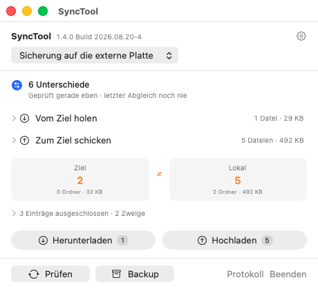
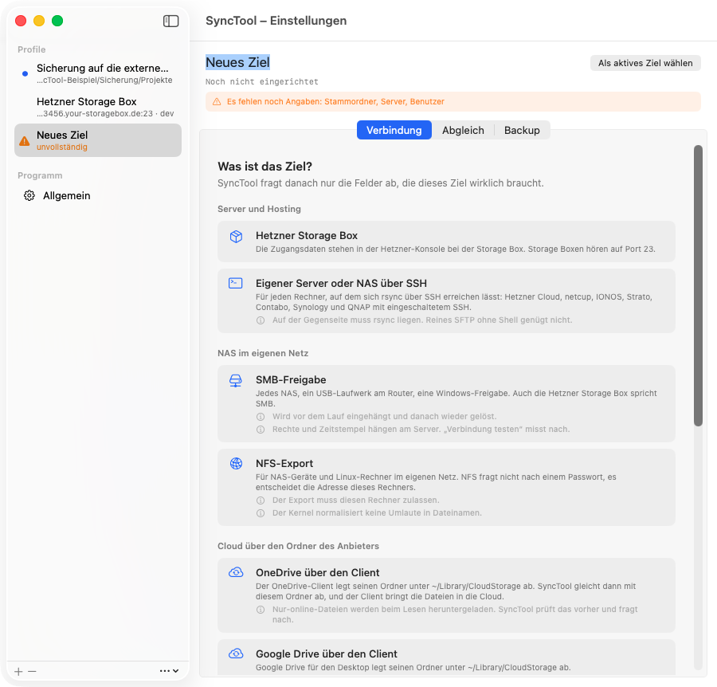

# SyncTool

[Deutsch](README.md) · [Changelog](CHANGELOG.md) · [Licence](LICENSE)

A macOS menu bar app that syncs a local project folder with another folder: on a
Hetzner Storage Box, your own server, an external disk, or inside a cloud
client's folder.

**The app itself is in German.** So is the detailed documentation under `docs/`.
This page exists so you can tell whether the tool is for you before you download
it.

The workflow is deliberately two-stage. **Prüfen** (check) compares both sides
and shows what has drifted apart. Only then do you decide whether to download or
upload. There is no automatic two-way resolution, no schedule and no folder
watching. If you want a service that quietly handles everything in the
background, this is the wrong tool.



## Targets

A new profile first asks what the target is, then shows only the fields that
target actually needs.



| Target | How | State |
| --- | --- | --- |
| Hetzner Storage Box | rsync over SSH, port 23 | works |
| Your own server or a NAS with SSH | rsync over SSH | works |
| External disk, second volume, any folder | directly in the file system | works |
| Nextcloud, MagentaCloud via the client folder | directly in the file system | works |
| Google Drive, OneDrive, Dropbox via the client folder | directly in the file system | works |
| SMB, NFS, WebDAV directly | mounted by the app | preset exists, mounting still to come |
| SFTP without a shell, FTP, S3 | needs a second transfer engine | planned |

An SSH target needs rsync on the far side. SFTP-only access is not enough, which
rules out a large part of shared hosting.

Until mounting is finished there is a workable detour for SMB and NFS: connect
the share in Finder and point the "external disk or folder" target at the mount
point.

## Download

The latest release is under
[Releases](https://github.com/LOGIN-TB/SyncTool/releases).

```bash
shasum -a 256 -c SHA256SUMS
```

## Requirements

- macOS 14 or newer.
- Apple Silicon or Intel. The app is a universal binary.
- For SSH targets: rsync. macOS ships openrsync, which works. Against rsync 3.x
  on the far side, `brew install rsync` is the more reliable combination, and the
  app says so.

## Installing

Open the DMG, drag SyncTool to Applications, launch it.

The app is signed with a Developer ID and notarized. On first launch macOS asks
once whether an app downloaded from the internet should really be opened. That
should be the only dialog.

**It is a menu bar app.** No window, no Dock icon. After launch the icon appears
at the top right; clicking it opens the status window.

**The first sync may trigger a permission prompt.** If the root folder sits in
`~/Documents`, `~/Desktop` or on an external volume, macOS asks. That prompt
belongs to macOS, not to the app, and without a yes the sync finds nothing there.

## How the sync decides

"Prüfen" lists both sides in full and compares the two inventories. For every
path it is then established whether it exists on the other side, rather than
inferred from two diff reports.

- Same checksum means equal, no matter how far the timestamps are apart.
- Timestamps more than a second apart: the newer side wins.
- Same timestamp, different size: conflict.
- Both sides changed since the last sync: conflict, even if one side is newer.
- A file present on only one side is ambiguous. SyncTool therefore remembers the
  common inventory per profile after every transfer and knows next time whether a
  path is new or was deleted on the other side.

Conflicts are shown, not resolved. Whichever direction you run first wins.

## Deleting

`--delete` runs only if it is allowed in the profile **and** ticked in the status
window **and** confirmed in the dialog. `--max-delete` aborts rather than
removing more than permitted. Files newly created on the receiving side are
protected and survive the run.

And the case that needs no bug at all: if the root folder is on a drive that
happens to be disconnected, rsync sees an empty side and `--delete` clears out
the other one. Against that, SyncTool aborts when the source side turns up empty
although files were there at the last sync.

## Backup

A sync is not a backup: it keeps both sides at the same state, which is exactly
why an accidental deletion travels straight to the other side. "Backup" packs
the local root folder into a zip archive, purely locally.

Names are sortable (`Projekte-bak-2026-05-23.zip`), nothing is ever overwritten,
and everything is packed including `node_modules`: the exclusion list applies to
the sync, not to the backup.

## Privacy

The app sends nothing anywhere: no telemetry, no update check, no crash reports.
Passwords live in the macOS Keychain and never appear in a command line, a file
or an environment variable. Host keys are kept in the app's own `known_hosts`;
`~/.ssh` is left untouched.

## Windows: planned

The sync logic lives in `macos/Sources/SyncCore` and depends on neither AppKit
nor SwiftUI: 31 of 33 files are plain Foundation. A Windows version would reuse
those decision rules along with their tests and get its own interface.

The real work is not there but with rsync, which does not exist natively on
Windows. So it needs either a second transfer engine or a different answer. No
date is set, and the repository is laid out so a `windows/` directory can join
without anything moving.

## Building from source

Xcode is not required, the Command Line Tools are enough.

```bash
make app
```

The result is `macos/build/SyncTool.app`, a universal binary. `make test` runs
the tests. Details on the universal build without Xcode, why the app needs no
entitlements, and how the screenshots are produced are in
[docs/entwicklung.md](docs/entwicklung.md) (German).

## Contributing, reporting, licence

- Bugs and wishes as an [issue](https://github.com/LOGIN-TB/SyncTool/issues).
  Please give both the version **and** the build number, shown at the top of the
  status window. German or English are both fine.
- Security issues **not** as an issue but via the private route in
  [SECURITY.md](SECURITY.md).
- Rules for code changes in [CONTRIBUTING.md](CONTRIBUTING.md). In short: no
  external dependencies ever, tests green, comments explain why. Note that code
  comments and test names are written in German.
- MIT licence, see [LICENSE](LICENSE).
