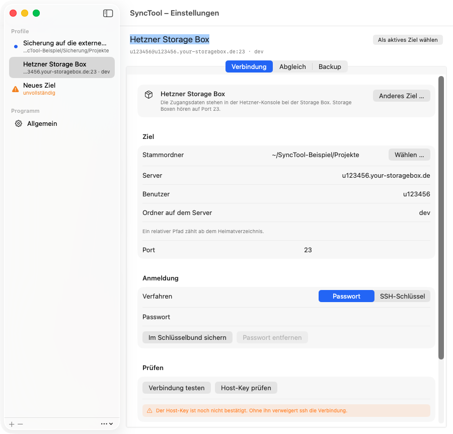
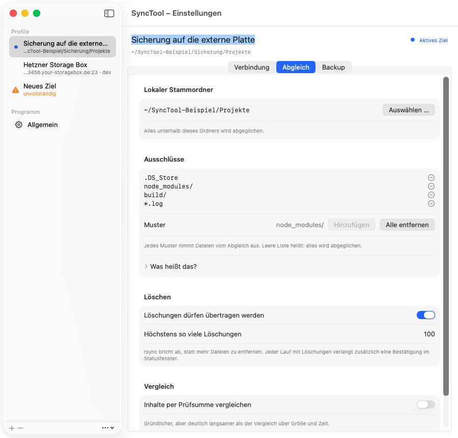
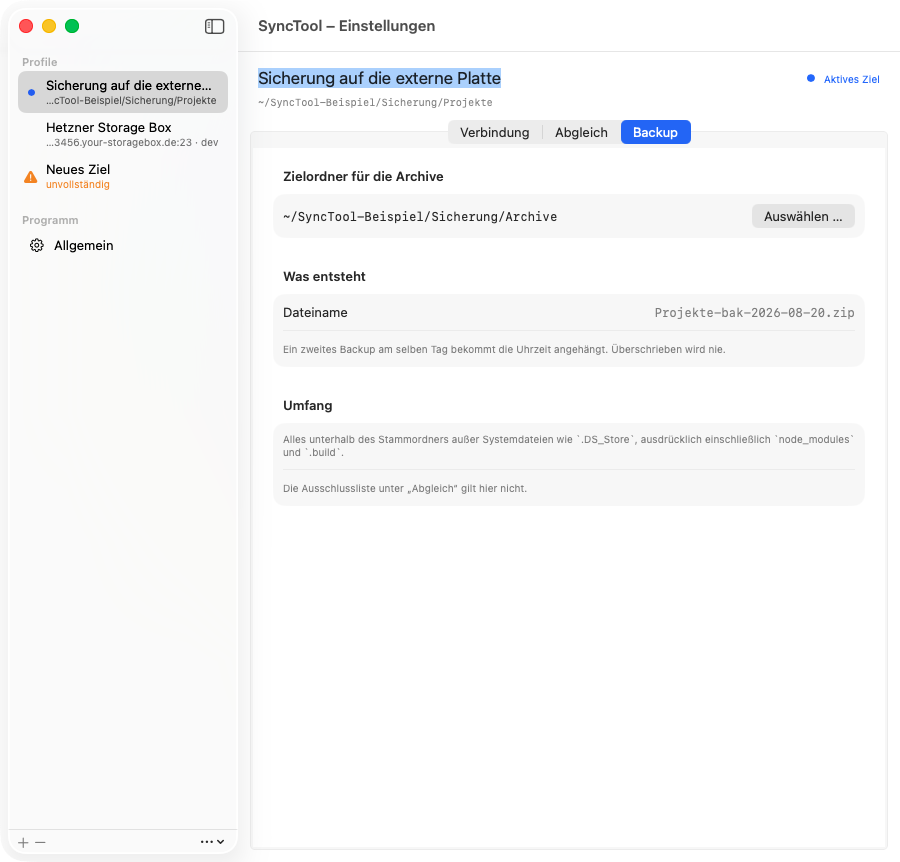

# SyncTool

[English](README.en.md) · [Änderungen](CHANGELOG.md) · [Lizenz](LICENSE)

Menüleisten-App für macOS, die einen lokalen Projektordner mit einem anderen
Ordner abgleicht: auf einer Hetzner Storage Box, einem eigenen Server, einer
externen Platte oder im Ordner eines Cloud-Clients.

Der Ablauf ist bewusst zweistufig. **Prüfen** vergleicht beide Seiten und zeigt,
was auseinanderläuft. Erst danach entscheidest du, ob heruntergeladen oder
hochgeladen wird. Es gibt keine automatische Zwei-Wege-Auflösung, keinen
Zeitplan und keine Ordnerüberwachung. Wer einen Dienst will, der im Hintergrund
alles selbst regelt, ist hier falsch.


## Welche Ziele gehen

Ein neues Profil fragt zuerst, was das Ziel ist, und zeigt danach nur die
Felder, die dieses Ziel wirklich braucht.


| Ziel | Weg | Stand |
| --- | --- | --- |
| Hetzner Storage Box | rsync über SSH, Port 23 | läuft |
| Eigener Server oder NAS mit SSH | rsync über SSH | läuft |
| Externe Platte, zweites Volume, beliebiger Ordner | direkt im Dateisystem | läuft |
| Nextcloud, MagentaCloud über den Client-Ordner | direkt im Dateisystem | läuft |
| Google Drive, OneDrive, Dropbox über den Client-Ordner | direkt im Dateisystem | läuft |
| SMB, NFS, WebDAV direkt | Einhängen durch die App | Vorlage da, Einhängen kommt noch |
| SFTP ohne Shell, FTP, S3 | zweite Übertragungsmaschine nötig | geplant |

Für ein Ziel über SSH muss auf der Gegenseite rsync liegen. Ein Zugang, der nur
SFTP erlaubt, genügt nicht, und das trifft einen großen Teil des Shared
Hostings. Siehe [docs/rsync.md](docs/rsync.md).

Bis das Einhängen fertig ist, gibt es für SMB und NFS einen brauchbaren Umweg:
die Freigabe im Finder verbinden und den Einhängepunkt als „Externe Platte oder
Ordner" eintragen.

## Herunterladen

Die neueste Fassung liegt unter
[Releases](https://github.com/LOGIN-TB/SyncTool/releases).

Prüfsumme nach dem Laden:

```bash
shasum -a 256 -c SHA256SUMS
```

## Voraussetzungen

- macOS 14 oder neuer.
- Apple Silicon oder Intel. Die App ist ein Universal Binary.
- Für ein Ziel über SSH: rsync. macOS bringt openrsync mit, das funktioniert.
  Gegen ein rsync 3.x auf der Gegenseite ist `brew install rsync` die
  verlässlichere Kombination, und die App sagt das auch. Siehe
  [docs/rsync.md](docs/rsync.md).

## Installieren

DMG öffnen, SyncTool in den Programme-Ordner ziehen, starten.

Die App ist mit einer Developer ID signiert und notarisiert. Beim ersten Start
fragt macOS einmal, ob eine aus dem Internet geladene App wirklich geöffnet
werden soll. Das ist der einzige Dialog, den es geben sollte.

**Es ist eine Menüleisten-App.** Kein Fenster, kein Dock-Symbol. Nach dem Start
erscheint das Symbol rechts oben in der Menüleiste, ein Klick öffnet das
Statusfenster. Ist die Menüleiste voll, verschwinden Symbole ohne Vorwarnung;
mit einem Werkzeug wie Bartender oder Ice bleiben sie erreichbar.

**Beim ersten Abgleich fragt macOS nach Berechtigungen.** Wenn der Stammordner
in `~/Dokumente`, `~/Schreibtisch` oder auf einem externen Volume liegt, kommt
eine Systemabfrage. Die gehört zu macOS und nicht zur App, und ohne ein Ja
findet der Abgleich dort nichts.

Wer selbst baut, bekommt keinen dieser Dialoge: lokal gebaute Apps tragen keine
Quarantäne-Markierung.

## Einrichten

1. App starten, in der Menüleiste auf das Symbol, dann auf das Zahnrad.
2. Links die Profilliste. Ein Profil ist ein Sync-Ziel, nicht ein Rechner. Mit
   `+` unten legst du eines an.
3. Erst kommt die Frage nach dem Ziel, dann das Formular.



Bei einem Ziel über SSH gehören zwei Knöpfe dazu, in dieser Reihenfolge:
**Host-Key prüfen** und den Fingerprint mit dem vergleichen, den der Anbieter
nennt, danach **Verbindung testen**. Ohne bestätigten Host-Key verweigert ssh
die Verbindung, und das ist Absicht. Der Test legt den Zielordner an, falls er
fehlt.

Optional **SSH-Schlüssel auf dem Server einrichten**. Das Profil läuft danach
ohne Passwort, was schneller und weniger störanfällig ist. Siehe
[docs/passwort.md](docs/passwort.md).



Unter **Abgleich** stehen Stammordner, Ausschlüsse, Löschregeln und
Prüfsummenvergleich. Änderungen werden sofort gesichert, einen Sichern-Knopf
gibt es nicht.

Unter **Programm, Allgemein** steht, was für alle Profile zusammen gilt: die
gefundene rsync-Fassung, der Zustand des Schlüsselpaars, der Ablageordner und
die Fassung des Programms.

### Mehrere Profile

- Ein oranges Dreieck in der Liste heißt: diesem Profil fehlen noch Angaben.
- Der Punkt in Akzentfarbe markiert das im Statusfenster **aktive** Ziel. Ein
  anderes Profil zu bearbeiten schaltet es nicht um, dafür gibt es den Knopf
  „Als aktives Ziel wählen". Das ist Absicht: ein Einstellungsfenster darf nicht
  ändern, was der Knopf „Hochladen" tut.
- **Duplizieren** über das Kontextmenü einer Zeile. Das Duplikat hat sein
  Passwort sofort, weil der Schlüsselbundeintrag an Server, Port und Benutzer
  hängt und nicht am Profil.
- Beim **Löschen** verschwinden das Profil, seine Bestandsliste und sein Eintrag
  in `state.json`. Nicht gelöscht werden das Passwort im Schlüsselbund, weil ein
  zweites Profil denselben Eintrag benutzen kann, und vorhandene Archive.

## Wie der Abgleich entscheidet

„Prüfen" listet beide Seiten vollständig auf und vergleicht die Bestände. Damit
steht für jeden Pfad fest, ob es ihn auf der anderen Seite gibt, statt es aus
zwei Differenzmeldungen zu erschließen.

- Gleiche Prüfsumme heißt gleich, egal wie weit die Zeitstempel auseinanderliegen.
- Zeitstempel mehr als eine Sekunde auseinander: die neuere Seite gewinnt.
- Gleicher Zeitstempel, andere Größe: Konflikt.
- Beide Seiten seit dem letzten Abgleich geändert: Konflikt, auch wenn eine
  Seite neuer ist.
- Eine Datei nur auf einer Seite ist zweideutig. Dafür merkt sich SyncTool nach
  jeder Übertragung den gemeinsamen Bestand je Profil und weiß beim nächsten Mal,
  ob ein Pfad neu ist oder auf der anderen Seite gelöscht wurde.

Konflikte werden angezeigt, nicht aufgelöst. Welche Richtung du zuerst
ausführst, gewinnt.

Die vollständige Begründung samt Bestandsarithmetik steht in
[docs/entscheidungen.md](docs/entscheidungen.md).

Nach jedem Prüfen steht unter dem Ergebnis, wie viele Einträge jede Seite hat
und wie viele die Ausschlussliste verdeckt. Die Zahlen sind dafür da, sie gegen
einen FTP-Client zu halten. Siehe [docs/ausschluesse.md](docs/ausschluesse.md).

## Löschen

`--delete` läuft nur, wenn es im Profil erlaubt ist **und** im Statusfenster
angehakt **und** im Bestätigungsdialog freigegeben wurde. `--max-delete` bricht
ab, statt mehr zu entfernen als erlaubt. Was auf der Gegenseite neu entstanden
ist, wird geschützt und überlebt den Lauf.

Und der Fall, der keinen Fehler in der App braucht: liegt der Stammordner auf
einem Laufwerk, das gerade nicht verbunden ist, sieht rsync eine leere Seite und
`--delete` räumt die andere aus. Dagegen bricht SyncTool ab, wenn auf der
Quellseite nichts zu finden ist, obwohl beim letzten Abgleich dort Dateien
lagen. Siehe [docs/loeschen.md](docs/loeschen.md).

## Backup

Ein Abgleich ist kein Backup: er hält beide Seiten auf demselben Stand, und
genau deshalb wandert ein versehentliches Löschen sofort mit. „Backup" packt den
lokalen Stammordner in ein Zip-Archiv, rein lokal, ohne Verbindung.



Der Name ist sortierbar (`Projekte-bak-2026-05-23.zip`), überschrieben wird
nie, und gepackt wird alles, auch `node_modules`: die Ausschlussliste gilt für
den Abgleich, nicht für die Sicherung. Siehe [docs/backup.md](docs/backup.md).

## Wo was liegt

| Ort | Inhalt |
| --- | --- |
| `~/Library/Application Support/SyncTool/profiles.json` | Profile samt Zielordner der Archive, ohne Passwörter |
| `~/Library/Application Support/SyncTool/inventory-<profil>.json` | gemeinsamer Bestand je Profil |
| `~/Library/Application Support/SyncTool/state.json` | Zeitpunkt des letzten Abgleichs je Profil |
| `~/Library/Application Support/SyncTool/known_hosts` | bestätigte Host-Keys, `~/.ssh` bleibt unberührt |
| `~/Library/Application Support/SyncTool/id_ed25519` | Schlüsselpaar, falls angelegt |
| Schlüsselbund | Passwörter, als Internet-Passwort je Server und Benutzer |

Die App sendet nichts nach außen: keine Telemetrie, keine Aktualisierungsprüfung,
keine Fehlerberichte. Was über die Leitung geht, geht an dein Ziel.

## Windows: geplant

Die Logik des Abgleichs liegt in `macos/Sources/SyncCore` und hängt weder an
AppKit noch an SwiftUI: 31 von 33 Dateien sind reines Foundation. Eine
Windows-Fassung würde diese Entscheidungsregeln samt Tests übernehmen und eine
eigene Oberfläche bekommen.

Der eigentliche Aufwand liegt nicht dort, sondern bei rsync: das gibt es auf
Windows nicht nativ. Es braucht also entweder eine zweite Übertragungsmaschine
oder eine andere Antwort. Ein Termin steht nicht fest, und das Repo ist so
aufgebaut, dass ein `windows/` daneben passt, ohne dass etwas umzieht.

## Aus dem Quelltext bauen

Xcode wird nicht gebraucht, die Command Line Tools reichen.

```bash
make app
```

Das Ergebnis liegt unter `macos/build/SyncTool.app`, als Universal Binary für
Apple Silicon und Intel. `make test` fährt die Tests, `make run` baut schnell
und startet. Wie das Universal Binary ohne Xcode entsteht, warum die App keine
Entitlements braucht und wie die Bildschirmfotos erzeugt werden, steht in
[docs/entwicklung.md](docs/entwicklung.md).

## Mitmachen, Fehler melden, Lizenz

- Fehler und Wünsche als [Issue](https://github.com/LOGIN-TB/SyncTool/issues).
  Bitte Fassung **und** Baunummer nennen, beide stehen oben im Statusfenster.
- Sicherheitslücken **nicht** als Issue, sondern über den privaten Weg in
  [SECURITY.md](SECURITY.md).
- Regeln für Änderungen am Code in [CONTRIBUTING.md](CONTRIBUTING.md). Kurz:
  keine externen Abhängigkeiten, Tests grün, Kommentare sagen warum.
- MIT-Lizenz, siehe [LICENSE](LICENSE).
